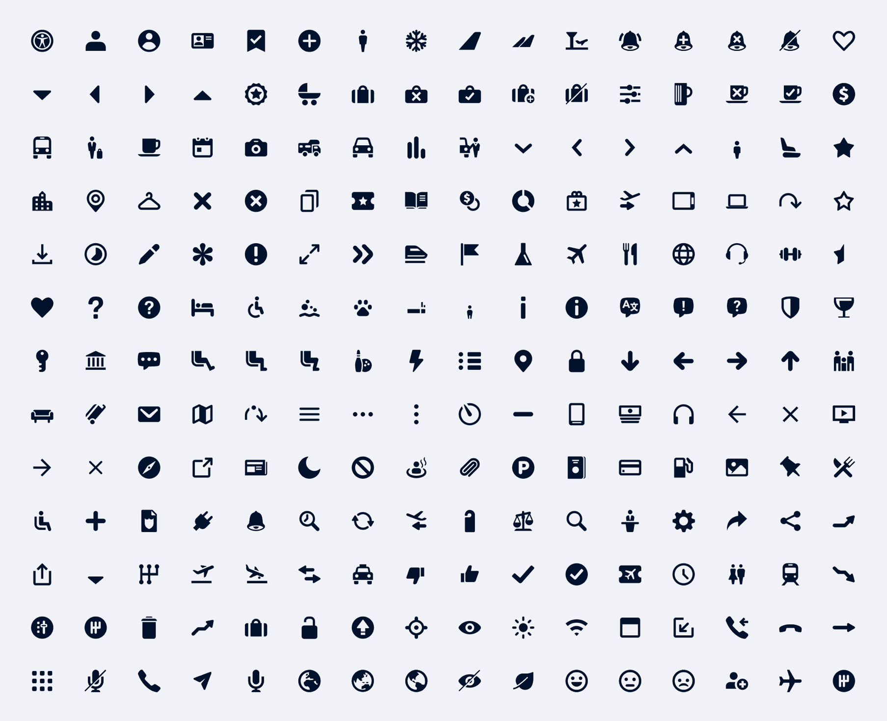

They draw on widespread visual shorthand conventions to simplify complex actions and categories into clear, concise visual signposting — aiding user journeys to help travellers get to what matters quicker.

## Overview

## Examples

