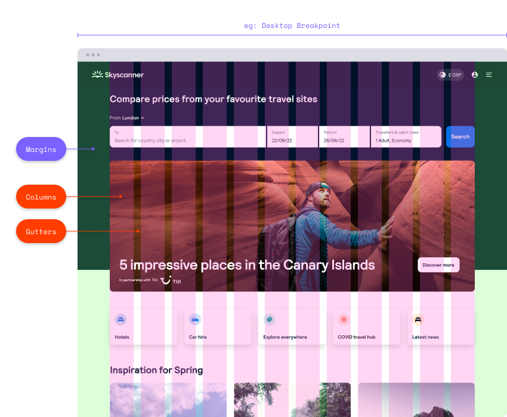

## Table of contents

## Anatomy

#### Breakpoints

When layouts no longer work on screen, we introduce breakpoints. We have 6 breakpoints.

#### Margins

The empty space to the left-and-right of the screen. Nothing goes in this area, it acts as intentional white space so text doesn't touch the edge of a display. This typically increases as screen sizes become larger.

#### Columns

We design with 12 columns, as it's easily devisable by 2, 3, 4, and 6. Content spans whole column widths, which won't have defined pixel value in responsive layouts. 

#### Gutters

The empty space between columns, this separates content. If the gap is too great, the perception is content might be be linked.

## Breakpoint and Margins

| Name          	| Scale       	| Margins 	| Scale in rems |
|---------------	|-------------	|---------	| ------------- |
| Small Mobile  	| 320-359px   	| 16px    	| 20-22.438rem  |
| Mobile        	| 360-512px   	| 24px    	| 22.5–32rem    |
| Small Tablet  	| 513-768px   	| 24px    	| 32.063–48rem  |
| Tablet        	| 769-1024px  	| 32px    	| 48.063–64rem  |
| Desktop       	| 1025-1280px 	| 48px    	| 64.063–80rem  |
| Desktop Large 	| 1281px +    	| 48px    	| 80.063rem +   |

## For Engineers

#### Breakpoints

Backpack breakpoints on Web are available as mixins in Sass or in the BpkBreakpoint component.
* To use Backpack breakpoints in Sass, have a look at our Sassdoc [breakpoints mixins page](https://backpack.github.io/sassdoc/#breakpoints-mixin)
* To use the BpkBreakpoint component, have a look at our [BpkBreakpoint component page](https://backpack.github.io/components/breakpoint?platform=web)

#### Margins

Layout grid margins are meant to be used as the empty space to the left-and-right of the screen.
You should be using these in the form of tokens.
For a full list of layout grid margin tokens, have a look at our [tokens page](/tokens/layout-grid-margins).

## For Designers

If you're designing new screens, we can use Columns and Gutters in addition to set Breakpoints and Margins. These are available through [Figma Foundations](https://www.figma.com/file/KXf2gHNLDe2cXWUoHl4cTX/Backpack-Foundations?node-id=2081%3A531) as Grid Styles.

## Grid Styles in Figma

| Name          	| Scale       	| Column Type 	| Columns 	| Gutters 	| Margins 	| Max Width        	|
|---------------	|-------------	|-------------	|---------	|---------	|---------	|------------------	|
| Small Mobile  	| 320-359px   	| Stretch     	| 4       	| 24px    	| 16px    	| Fluid            	|
| Mobile        	| 360-512px   	| Stretch     	| 4       	| 24px    	| 24px    	| Fluid            	|
| Small Tablet  	| 513-768px   	| Stretch     	| 4       	| 24px    	| 24px    	| Fluid            	|
| Tablet        	| 769-1024px  	| Stretch     	| 12      	| 24px    	| 32px    	| Fluid            	|
| Desktop       	| 1025-1280px 	| Stretch     	| 12      	| 24px    	| 48px    	| Fluid            	|
| Desktop Large 	| 1281px +    	| Stretch     	| 12      	| 24px    	| 48px    	| Fluid, or 1224px 	|

## What is, and isn't in Backpack

There are many ways to do **Columns** and **Gutters** in code, some of which are already live across different parts of Skyscanner. For this reason we won't be offering **Columns** or **Gutters** as part of Backpack. Each squad will continue to setup this part of the grid as they see fit.

Furthermore, there will be **no grid component** made available. Squads should use either **flexbox** or **css-grid** to implement the designs using the defined backpack tokens.

