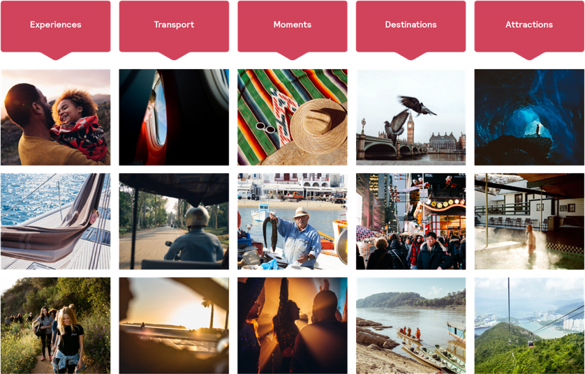
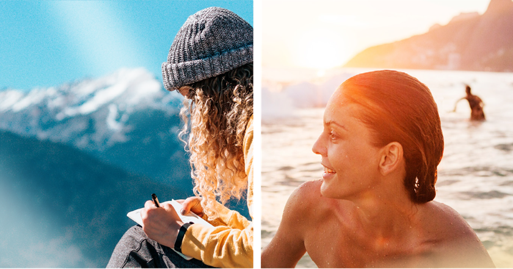
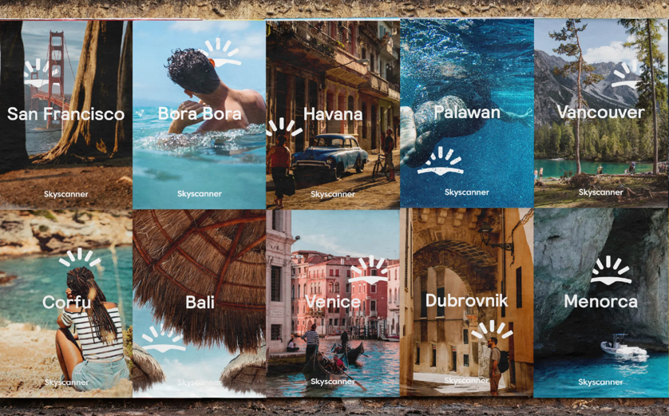

## Introduction

Our art direction serves two purposes, to inform and inspire. We fulfil these purposes by using a photographic scale that spans from emotional to functional images — allowing us to express complex messages with single photographs for a wide range of subject matters.

## Art direction

## Treatment

## Examples

