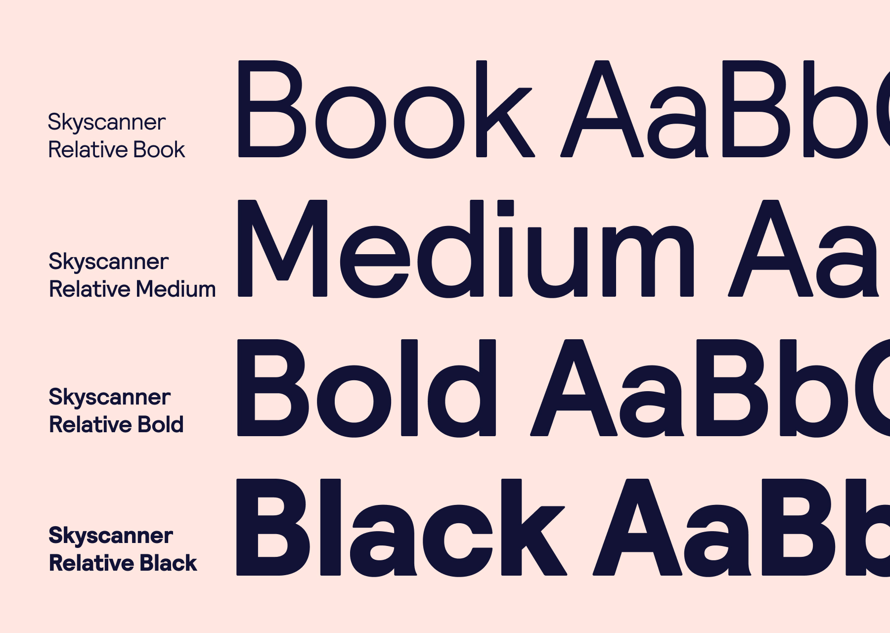
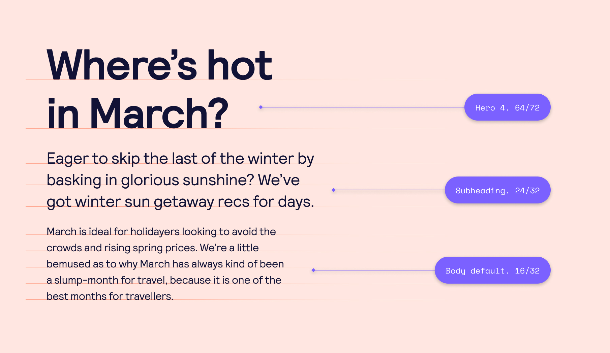

## Table of contents

## Introduction

Everyone has a type. Skiing across an untouched piste? Yep. Being horizontal on a deserted beach? Phwoar. But we also have a thing for typography.

The relationship between weight, size, line height, reading width, font pairing and justification is complicated to get right – and easy to get wrong. These tiny details really change the UI – and most importantly – our travellers' experience.

---

## Typeface

#### Skyscanner Relative

Our typeface is Skyscanner Relative, a unique type family of proportional graded weights. Its forms reflect the geometry of our symbol, with even stroke widths and slightly rounded corner profiles.

Optimised for use on-screen, we have worked alongside its creators, Colophon, to ensure fast load-times and perfect digital rendering.

## Product Type scale

<iframe style={{border: '1px solid rgba(0, 0, 0, 0.1)'}} width="800" height="1200" src="https://www.figma.com/embed?embed_host=share&url=https%3A%2F%2Fwww.figma.com%2Ffile%2Fa0xD8Q9AS85pIEnNtBBf2s%2FCMS-Images%3Fnode-id%3D370%253A6306" allowfullscreen></iframe>

#### Background

Our product type is from the major third scale and is designed to fit our 8px baseline grid.  As the letter size increases, the line height decreases to match the intended use case. Paragraphs require more line height to allow for better legibility, whereas bold headline should never stretch beyond a line or two and can afford to be more tightly set. This achieves harmony within the scale, as well as accurate design that scales easily across multiple devices and platforms.

#### Line height

For everything to be optically balanced we need to use different line heights to achieve visual balance. For example, Hero uses a tight line height of 100%-110% (depending on Hero), whereas Body Longform uses line-height of 140% for better readability. When used stacked together, there's a perfect harmony between all styles. 

#### Styles

In the new product type scale we have 15 styles (plus two for labels), these are sub-organised into groups with semantic names. At a glance you can tell difference between subheading and body default. Let's take a look:

| Style                      | Use case                                                                                                                                      |
| -------------------------- | --------------------------------------------------------------------------------------------------------------------------------------------- |
| Hero 1-5                   | Intended for large display copy. The five sizes offer flexibility around usage size with one weight. Typically, a page may contain this once. |
| Heading 1-5                | Five heading sizes offer great flexibility for Headlines with one weight.                                                                     |
| Paragraphs and body styles | These range between subheading and caption. These both have the largest line heights for comfortable reading of larger pieces of copy.        |
| Footnote and caption       | Limited use cases for very small pieces of text.                                                                                              |
| Labels                     | For use only inside of labels and buttons.                                                                                                    |

#### Marketing type scale

This is a full range of sizes, weights, and appropriate line heights for Marcom designs.

<iframe style={{border: '1px solid rgba(0, 0, 0, 0.1)'}} width="800" height="1200" src="https://www.figma.com/embed?embed_host=share&url=https%3A%2F%2Fwww.figma.com%2Ffile%2Fa0xD8Q9AS85pIEnNtBBf2s%2FCMS-Images%3Fnode-id%3D439%253A6494" allowfullscreen></iframe>

## How to set typography using Backpack

#### Web

Using the BpkText component - [BpkText](https://backpack.github.io/components/text?platform=web)

If using BpkText component is not possible, have a look at the Sass mixins we support here - [SassDoc](https://backpack.github.io/sassdoc/#typography)

#### iOS

Using the BPKLabel component - [BPKLabel](https://backpack.github.io/components/text?platform=ios)

#### Android

Using the BpkText component - [BpkText](https://backpack.github.io/components/text?platform=android)

## Migrating to the new Backpack typography system

Typography at Skyscanner has changed. In Backpack, we created migration guides to enable consumers to migrate to the new typography system:

* If you are using typography tokens and wish to migrate to mixins instead, have a look at this guide - [Typography tokens migration](/typography-tokens-migration-guide)
* If you are using BpkText component and wish to remove the deprecated weight property, have a look at this guide - [Typography BpkText weight deprecation](/typography-bpk-text-migration-guide)