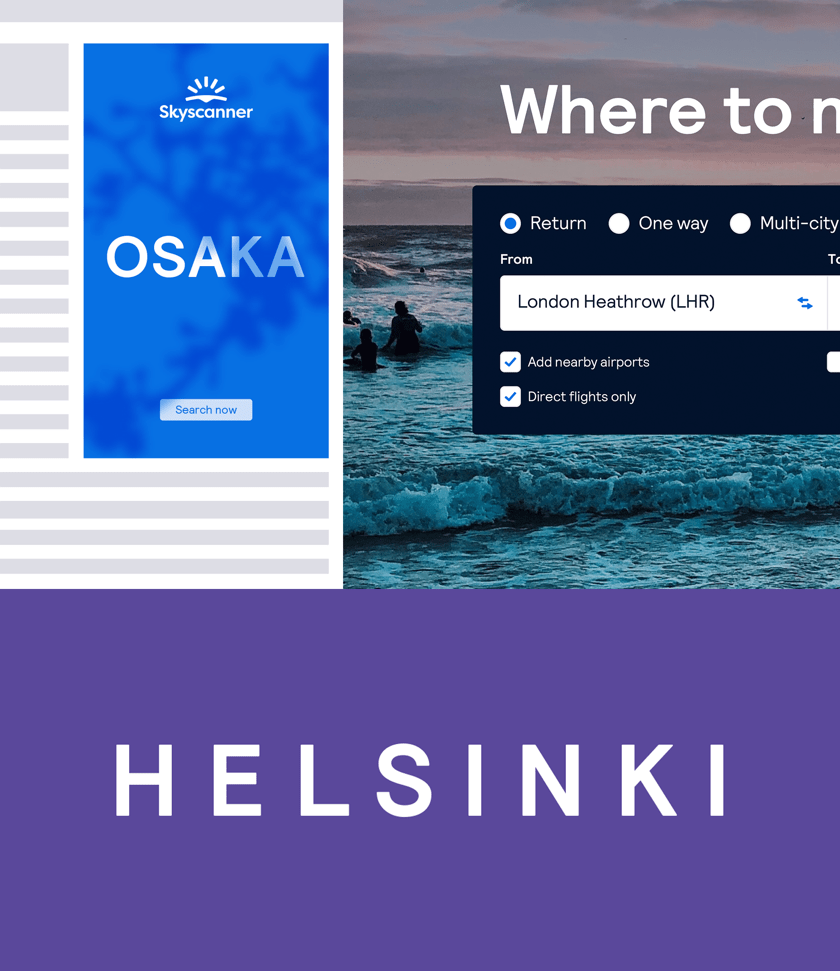

import { FontFace, TypeScale } from '../components/Typography';

## Table of contents

## Introduction

Typography is the visualisation of our brand's voice, and we use it to communicate with our audiences in a wide range of tones.

From providing functional in-product travel details to expressive out-of home inspiration, our flexible typographic approach allows us to appear in the right way, at the right time.

<iframe style={{border: '1px solid rgba(0, 0, 0, 0.1)'}} width="800" height="450" src="https://www.figma.com/embed?embed_host=share&url=https%3A%2F%2Fwww.figma.com%2Ffile%2Fa0xD8Q9AS85pIEnNtBBf2s%2FCMS-Options%3Fnode-id%3D268%253A6526" allowfullscreen></iframe>

## Skyscanner Relative

<FontFace />

We use a type scale system for type hierarchy and to create harmony across our products. 
Our custom cut of Relative integrates our custom measures for leading and tracking allowing very minimal engineering customisation and being fit for purpose in it’s standard form.

## Type scale

We use a type scale system for type hierarchy and to create harmony across our products. 
Our custom cut of Relative integrates our custom measures for leading and tracking allowing very minimal engineering customisation and being fit for purpose in it’s standard form.

<TypeScale />

## Examples

