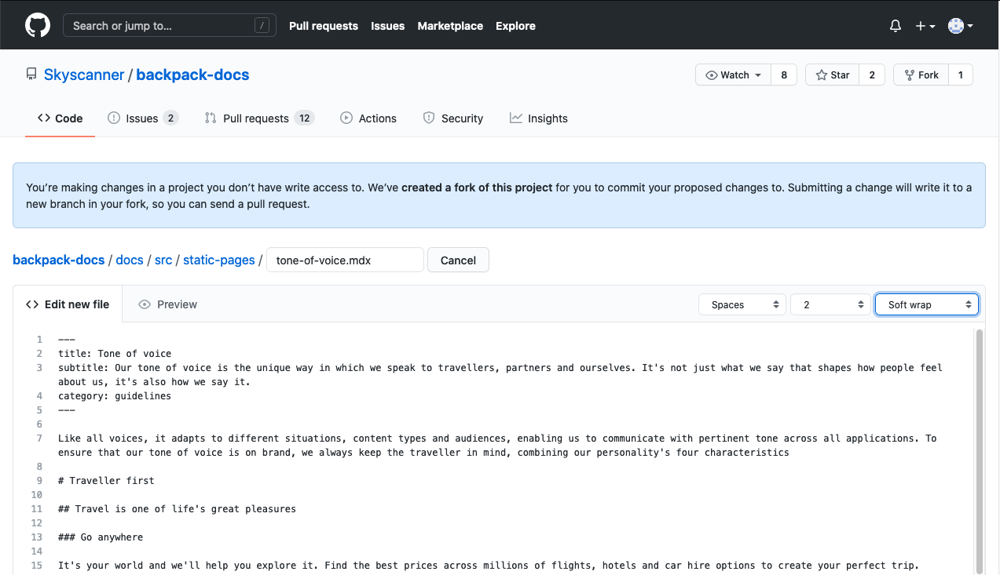
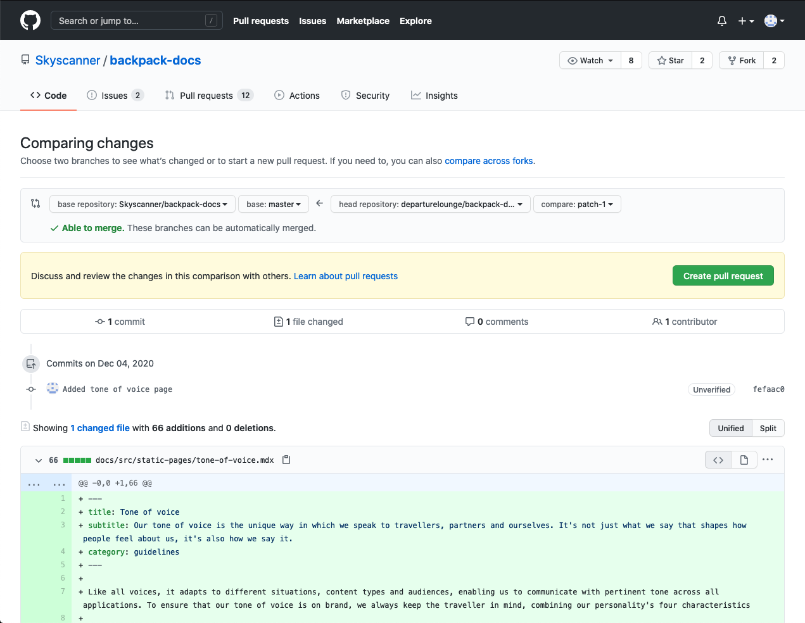
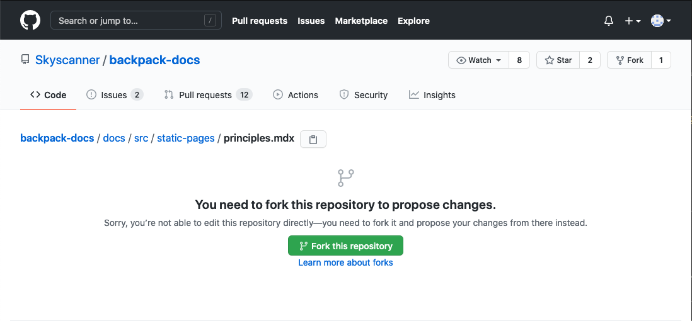

## Before you start

This guide explains how to add new pages to this website, as well as how to change existing pages.

Rest assured that it's impossible for your changes to break this website. The design system team reviews all changes before publishing.

If you get stuck at any point, talk to the design system team on Slack in the #backpack channel.

### GitHub

Backpack uses a service called GitHub to manage content on this website.

To make changes to the website's content you'll need a GitHub account. If you don't already have one you can register for free on [GitHub's website](https://github.com).

### Markdown

Pages on this website are written using [Markdown](https://www.markdownguide.org/getting-started/), a markup language for writing documents. It's very simple and you don't need any knowledge of software engineering to use it.

## Get started

The instructions are different, depending on whether you want to add a new page or change an existing page.

* [Add a new page](#add-a-new-page)
* [Change an existing page](#change-an-existing-page)

## Add a new page

### 1. Confirm that it's an editable section

Not all parts of the website can be updated through this process. Currently, the _Using Backpack_ and _Guidelines_ sections can be changed using these instructions.

> We're working on making more sections compatible with this process.

### 2. Go to GitHub

Go to the [`static-pages` folder on GitHub](https://github.com/Skyscanner/backpack-docs/tree/master/docs/src/static-pages), which is where all the markdown files for these pages are kept. This is where you'll add your new file that will be turned into a page on the website.

Press 'Add file', then in the drop down choose 'Create new file'.

### 3. Add your content

You'll be taken to a blank page where you can add your file's content.

#### 3.1 Choose a file name

Enter a file name for your page in the "Name your file..." text box. File names must be in lower case and can contain letters, numbers and hyphens. Spaces aren't allowed.

> Your filename must end with `.mdx`, so that GitHub identifies it as a markdown file.

If you're unsure, go back to the previous step and use the existing files for inspiration.

#### 3.2 Add the page information

Your file must begin with a small block of text that includes some details about the page. Copy one [from an existing page](https://raw.githubusercontent.com/Skyscanner/backpack-docs/master/docs/src/static-pages/website-contribution-guide.md) and paste it into your new page. `category` should either be `using` or `guidelines`.

#### 3.3 Add the page content

Underneath the page information block, you can now add your markdown content.

At any point you can press the 'Preview changes' button at the top of the text box to get a preview of your page.

##### Including images

If you're including images in your page, add a placeholder message in the text box where you'd like to put them. You'll have the opportunity to upload them in a later step.

### 4. Propose your new file

Once you're happy, find the section called 'Propose new file' at the bottom of the page.

Add a short description explaining your new file in the first field. This information will be added to the file's changelog. Try to be as clear and concise as possible, to help future users understand the update.

If you need to provide more information about your file, you can add more detail in the larger field below.

### 5. Confirm your changes

You'll be shown a confirmation page where you can review your new file.

If you spot a mistake, you can go back to the previous page and correct it.

If you are happy with your changes, select 'Create pull request'. You'll have one more chance to review your change on the next page before you submit it to the design system team to review.

### 6. Create a pull request

A pull request is a request to the design system team to add ('pull') your new file into the website.

Once you've created a pull request, your new file and any comments you've written will be publicly visible, meaning that anyone can see them on GitHub.

You'll see the description you entered in step 3 and can add some additional information if you want to.

#### Including images

If you want your page to include any images, you can add them to the large text box and they'll be uploaded.

Once you're happy, select 'Create pull request'.

### 7. Wait for the team to review your pull request

The design system team will be notified of your suggestion and will review it soon, usually within a day.

The team will either:

* accept your proposal and publish your new page straight away
* accept your proposal but ask for some changes before publishing
* not accept your proposal and explain why

## Change an existing page

### 1. Go to the page

Go to the page you'd like to change. At the bottom of the page, look for a section called 'Improve this page'.

If the page doesn't have an 'Improve this page' section it can't be updated using these steps. To change it, talk to a member of the design system team.

> We're working on making more pages compatible with this process.

### 2. Edit the file

Follow the link to edit the page. This will take you to GitHub.

You might see a message on screen asking you to fork the repository. This is nothing to worry about. It just means you're making a copy of the website that you can edit. Press the 'Fork this repository' button to continue.

Next, you'll see the markdown file in a text editor. Make your changes.

Here's an example showing how to update the [Principles page](/using/principles).

In this example, the uppercase 'C' on the word 'Component' has been changed to lower case.

### 3. Propose your change

Once you're happy, find the section called 'Propose changes' at the bottom of the page.

Add a short description explaining the reason for your change in the first field. This information will be added to the file's changelog. Try to be as clear and concise as possible, to help future users understand the update.

If you need to provide more information about your change, you can add more detail in the larger field below.

### 4. Confirm your changes

You'll be shown a confirmation page where you can review the changes you've made.

If you spot a mistake, you can go back to the previous page and correct it.

If you are happy with your changes, select 'Create pull request'. You'll have one more chance to review your change on the next page before you submit it to the design system team to review.

### 5. Create a pull request

A pull request is a request to the design system team to add ('pull') your changes into the website.

Once you've created a pull request, your proposed change and any comments you've written will be publicly visible, meaning that anyone can see them on GitHub.

You'll see the description you entered in step 3 and can add some additional information if you want to.

Once you're happy, select 'Create pull request'.

### 6. Wait for the team to review your pull request

The design system team will be notified of your suggestion and will review it soon, usually within a day.

The team will either:

* accept your proposal and publish your change straight away
* accept your proposal but ask for some changes before publishing
* not accept your proposal and explain why
